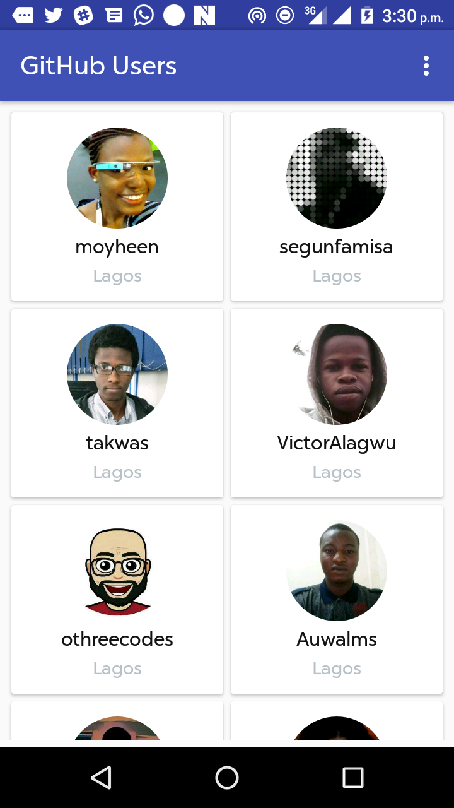

#AndelaChallengeProject

Android app to retrieve a list of Java Developers in Lagos using the Github API 


## Getting Started

You can glone or download this project to your local machine. 

### Prerequisites

Intermediate Android Experience
Little or no experience with [Retrofit] (http://square.github.io/retrofit/) Library
[GitHub API  ] (https://api.github.com/search/users?q=language:java%20location:lagos)


### Dependencies
Obviously to use Retrofit you need this library in your dependencies. You also need a converter used for JSON format : Gson.
Parceler is used for serialization and deserialization of objects.

```
 compile 'com.squareup.retrofit2:converter-gson:2.1.0'
    compile 'com.squareup.retrofit2:retrofit:2.1.0'
```


### GitHub Api Response in JSON


```
{
  "total_count": 142,
  "incomplete_results": false,
  "items": [
    {
      "login": "moyheen",
      "id": 8110201,
      "avatar_url": "https://avatars1.githubusercontent.com/u/8110201?v=3",
      "gravatar_id": "",
      "url": "https://api.github.com/users/moyheen",
      "html_url": "https://github.com/moyheen",
      .........
    },
 ```
 
### What do you need ?

There is a minimum amount of files to write to request a Rest Api, you need at least one interface to write your query, 
a model to retrieve the api response and a restclient to make your calls.

### POJO
you need models to retrieve data from JSON returned by the server. You have to create POJOs, the fields name have to be the same as those in the JSON but you can have different names if you use @SerializedName annotation to specify the name of the field in the JSON. 
There is Serializable and Parcelable for serialization and deserialization of object. 

```
public class User implements Parcelable {

    @SerializedName("login")
    @Expose
    private String login;
    .......
    }
```


### Service

You have to create an interface called Service here to manage your url calls. 
In this interface you have to specify the type of the request like POST, GET, PUT, etc. 
For an asynchronized request you have to add a Callback to your methods and return void.  

To make the HTTp request we need to send some paramenters. In this case it is a query so we can also add ``q`` query parameters with @Query. 

```
public interface RestApiService {

    @GET("/search/users")
    Call<UserList> getUserList(@Query("q") String filter);

}

```


### you will have to create your restclient object with your services.

    ```
 public RestApiBuilder() {
        retrofit = new Retrofit.Builder()
                .baseUrl(BASE_URL)
                .addConverterFactory(GsonConverterFactory.create())
                .build();
    }

    public RestApiService getService() {
        return retrofit.create(RestApiService.class);
    }
    
    ```



## Authors

* **Nsikak Thompson** - *Initial work* - [PurpleBooth](https://github.com/Nsikaktopdown)


